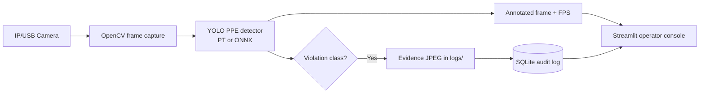

# ⛑️ Real-Time Industrial PPE Safety Detection System

[](https://www.python.org/)
[](https://docs.ultralytics.com/)
[](https://onnxruntime.ai/)
[](https://streamlit.io/)

Production-minded computer-vision application for monitoring industrial PPE compliance in real time. It uses custom YOLO PPE weights to identify hard hats, safety vests, masks, and explicit missing-gear classes; it then creates an immutable local audit trail with evidence snapshots.

> **Status:** application scaffold is ready. Add validated PPE-trained weights to `models/` before operating. This project is an operator-assistance tool, not a substitute for site safety procedures or human review.

## Why it matters

PPE checks are usually manual, periodic, and difficult to audit after an incident. This system moves detection close to the camera, gives safety teams low-latency visual alerts, and automatically records the evidence required for follow-up.

## Architecture



## Technical highlights

- **Dual runtime:** accepts Ultralytics `.pt` weights during iteration and exportable `.onnx` weights for edge deployment.
- **Low-latency vision path:** direct OpenCV capture, resize guardrail, in-frame annotations, and live FPS telemetry.
- **Clear compliance signal:** green = detected PPE, red = explicitly labelled violation, blue = person/context.
- **Auditability:** background SQLite logging prevents UI stalls and saves timestamped image evidence under `logs/`.
- **Operational UI:** local Streamlit dashboard with threshold/class controls, data export, time filtering, and snapshot review.
- **Safe failure modes:** typed interfaces, model/path validation, camera/model error messages, and parameterised database writes.

## Expected labels

Use a PPE-trained detection model whose class metadata contains labels such as `Hardhat`, `Safety Vest`, `Mask`, and, for violation alerts, `no_helmet`, `no_vest`, or `no_mask`. Standard COCO YOLO weights are useful for detecting people but cannot establish PPE compliance.

## Benchmark protocol and targets

Measure on your site-held-out test split and target camera hardware before claiming production performance. The table below is a **reporting template / target**, not fabricated test results.

| Runtime | Hardware | mAP@0.5 | Precision | Recall | FPS |
|---|---|---:|---:|---:|---:|
| PyTorch FP32 | CPU | Measure | Measure | Measure | Measure |
| ONNX Runtime FP32 | CPU | Same model | Same model | Same model | Measure |
| PyTorch FP16 | NVIDIA GPU | Measure | Measure | Measure | Measure |
| ONNX Runtime GPU/TensorRT | NVIDIA GPU | Same model | Same model | Same model | Measure |

## Quickstart

```powershell
git clone <your-repository-url>
cd ppe-detection-system
python -m venv venv
.\venv\Scripts\Activate.ps1
pip install -r requirements.txt
```

1. Place a custom PPE detection model in `models/` (for example `models/ppe_yolo.pt`).
2. Start the local console:

```powershell
streamlit run app.py
```

3. Open the shown local URL, select **Start webcam**, and review alerts in **Analytics Dashboard**.

## ONNX edge export

```powershell
python export_onnx.py models\ppe_yolo.pt --imgsz 640 --simplify
```

The exporter writes an `.onnx` artefact next to the input weights. The application prioritises `.onnx` files in `models/` for edge-oriented execution.

## Project layout

```text
ppe-detection-system/
├── app.py                 # Streamlit operator console
├── export_onnx.py         # YOLO → ONNX conversion CLI
├── src/detector.py        # PT/ONNX inference and annotations
├── src/database.py        # Async SQLite audit logger
├── src/utils.py           # Image and evidence helpers
├── models/                # Local PPE model weights (git-ignored)
├── logs/                  # Saved violation snapshots (git-ignored)
└── violations.db          # Generated local audit database (git-ignored)
```

## Deployment notes

- Mount `logs/` and `violations.db` on durable storage for persistent audit history.
- Ensure cameras and the Streamlit service run on a trusted network; this sample has no authentication layer.
- Calibrate class labels, confidence thresholds, and snapshot cooldown per camera zone.
- Validate against low light, occlusion, helmet colour, and local site PPE variants before rollout.

## License

Add the license appropriate for your organisation before publishing the repository.
